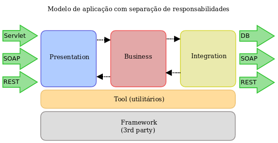

#Spring Core + Spring Web + Spring Boot + Spring Data + H2 in-memory
* Os ceps disponiveis no in-memory são da cidade de São Paulo (dump de 2012)

##Run app - port 8080
$mvn spring-boot:run

##Debug app - port 5005
$mvn spring-boot:run -Drun.jvmArguments="-Xdebug -Xrunjdwp:transport=dt_socket,server=y,suspend=n,address=5005"

##Exercício 1 - Serviço de BUSCA DE CEP

###URI
GET - **/cep/{ID}** - onde ID é o CEP no formato 00000000 (size 8)

##Exercício 2 - Salvar endereço do usuário seguindo as regras de CRUD

###URI

##Observações
- As tabelas uf, cidades, bairros e rua foram criadas a partir de um dump encontrado na internet

##Explicação

####Camadas da aplicação

Esta aplicação foi desenvolvida no padrão Presentation-Business-Integration, o que faz com que a mesma não tenha um aspecto monolítico, conforme a imagem abaixo descreve:

    (...)It's also worth emphasizing that putting behavior into the domain objects should not contradict **the solid approach of using layering to separate domain logic from such things as persistence and presentation responsibilities**. The logic that should be in a domain object is domain logic - validations, calculations, business rules - whatever you like to call it. (There are cases when you make an argument for putting data source or presentation logic in a domain object, but that's orthogonal to my view of anemia.)(...)

-	Presentation - Literalmente a camada de apresentação, nesta camada estão contidos os **Services** da aplicação (Também chamados de Entry-points, pode ser REST, SOAP, RPC, etc.)
-	Business - Os **Components** e os **Models**(Entidades, Business objects, etc.) ficam nesta camada, um **Component** tem como objetivo intermediar as chamadas entre a camada *Presentation* e *Integration*.
-	Integration - Os **Repositories** integram todo ou qualquer tipo de recurso externo, sendo eles RDBMS, NoSQL, Webservices, etc.

Esta padronização não tem como objetivo separar regras de negócio de suas entidades, deixaria a aplicação num modelo **anêmico**! A citação do artigo [Anemic Domain Model](http://www.martinfowler.com/bliki/AnemicDomainModel.html) de *Martin Fowler* em destaque abaixo retrata o objetivo:

Esta arquitetura auxilia na aplicação de pelo menos 2 princípios [**S**OLI**D**](https://scotch.io/bar-talk/s-o-l-i-d-the-first-five-principles-of-object-oriented-design) adequadamente:
-	S - Single-responsibility - Salvos os Components, Services e Repositories não possuem mais de uma responsabilidade.
-	D - Dependency inversion - A implementação dos Components são invisíveis para os Services, assim como as dos Repositories são invisíveis para Components (interface public, implementação package default)

####Spring Core + Spring Web + Spring Data + Spring Boot?

São recursos open-source robustos que unidos trazem grandes vantagens ao desenvolvedor, tais como: Boilerplate avoidance, Dependency Injection (IoC), Aspectos, REST(JAX-RS compliance), Convention-over-configuration, JPA, Caching, JavaConfig over XML e muito mais.

O Spring Boot possibilita a criação ágil de aplicações standalone já com suportes para métricas, fácil criação de perfis de deployment (principalmente utilizando YAML!)

O Spring Data possibilita o desenvolvimento ágil de repositórios utilizando JPA, integração com RDBMS, NoSQL - além da integração com RESTful stores (MongoDB, Neo4J).